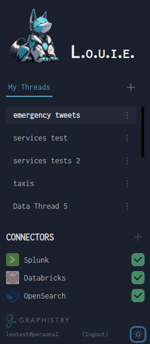

# Interface Navigation

Connector status & refresher

Thread adder

Thread picker & thread deleter

Connector adder

Personal profile
Active organization
Logout
Light/dark mode switcher

Space switcher

Manage

You login under an organization context, shown by the profile area 

You may be in several organizations: your unaffiliated personal account, your team, teams you collaborate with, etc. 

Within the active organization, you create threads either in your personal area or the org's shared area

Your organization has live data connectors: they are green when healthy, and you can ask Louie to re-index them

