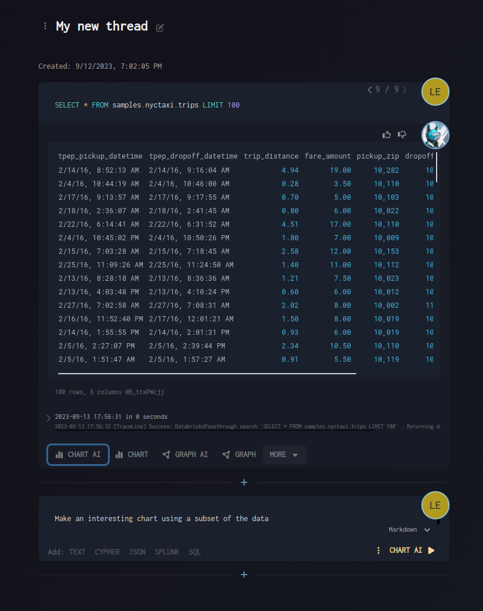

# Quick Launch Bar

The Quick Launch Bar provides a convenient way to quickly add new cells with preconfigured settings for different tool types.

## Features

- **One-click cell creation**: Add cells preconfigured for different tool types
- **AI and non-AI modes**: Choose between AI-powered and traditional modes for each cell type
- **Context-aware appearance**: Automatically appears after a cell has been run and has output to act on
- **Quick block addition**: Streamlined workflow for adding new analysis blocks

## How It Works

1. Run a cell that produces output
2. The Quick Launch Bar automatically appears below the cell
3. Select from available cell types and configurations
4. Choose between AI or non-AI modes as needed

## Visual Guide

