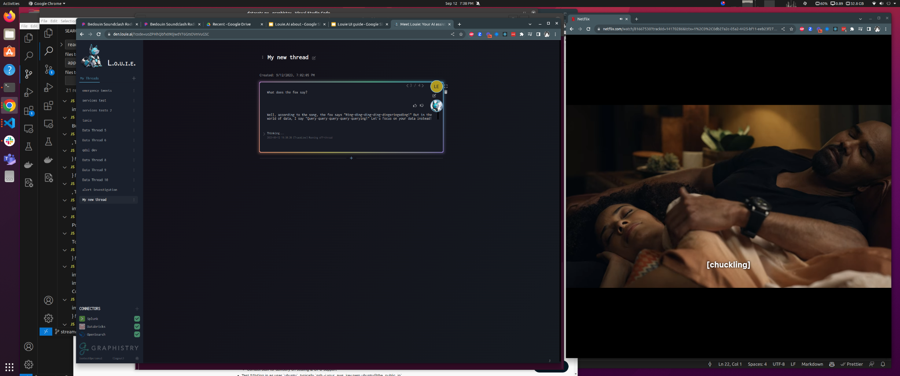

# Editing Blocks

Editing blocks allows you to refine and improve your analysis by modifying cell inputs after reviewing the output and execution history.

## Key Features

- **Edit Toggle**: Switch between view and edit modes for any block
- **Fullscreen Mode**: Expand blocks for detailed editing and review
- **Delete Function**: Remove blocks that are no longer needed
- **Execution History**: Review what Louie.AI was thinking and doing during execution

## How to Edit Blocks

1. **Run Your Initial Analysis**: Execute a block and review the output
2. **Access Edit Mode**: Click the edit button to modify your command
3. **Review Execution History**: Examine what Louie.AI was thinking and doing
4. **Revise Your Command**: Make improvements based on the results
5. **Re-run the Block**: Execute the updated command

## Navigation Features

Use the **left/right toggles** to easily reference:
- Previous cell run inputs
- Previous cell run outputs
- Execution history and decision-making process

This allows you to compare results and iteratively improve your analysis.

## Visual Guide
<!-- TODO: crop image -->
<!--  -->

## Benefits

- **Iterative Improvement**: Refine your analysis through multiple iterations
- **Learning from Results**: Understand how Louie.AI processes your requests
- **Efficient Workflow**: Quickly modify and re-run blocks without starting over
- **Context Preservation**: Maintain reference to previous runs while making improvements

