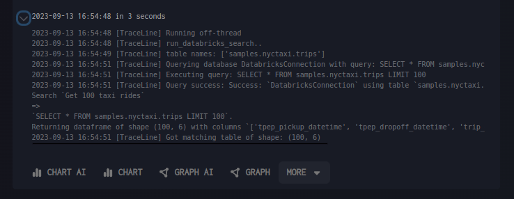

# Running AI Blocks

AI blocks let you analyze data using natural language commands instead of writing complex queries.

## How It Works

1. **Pick AI-mode tool** from the tool picker
2. **Write your request** in plain English
3. **AI generates the query** automatically
4. **Review and run** the generated query
5. **Get smart results** in optimized table format

## Key Features

- **Natural language commands** - describe what you want in plain English
- **Automatic query generation** - AI writes the technical queries for you
- **Smart result tables** - AI determines the best table structure
- **Fullscreen mode** - expand for detailed review
- **Transparent decisions** - see how AI interpreted your request

## Visual Guide

