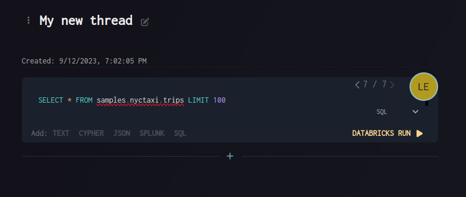
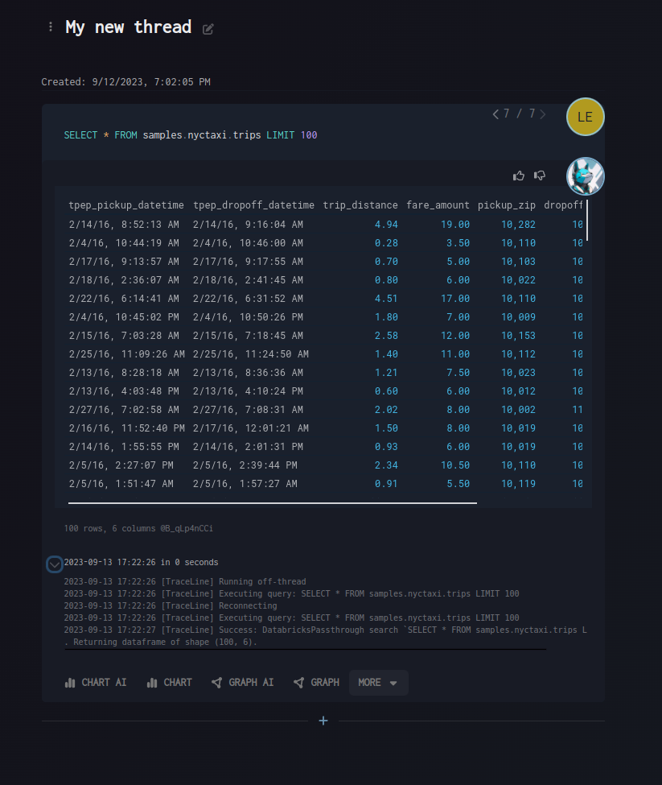

# Running Non-AI Blocks

Non-AI blocks let you write and execute traditional queries and commands directly, giving you full control over the syntax and execution.

## How It Works

1. **Pick non-AI tool** from the tool picker
2. **Write your command** using proper syntax
3. **Use syntax picker** (optional) for help with formatting
4. **Execute the query** directly
5. **Review results** in standard table format

## Key Features

- **Direct command execution** - write queries in their native syntax
- **Syntax picker support** - get help with proper formatting
- **Full control** - specify exactly what you want to execute
- **Standard result tables** - view output in traditional table format
- **Fullscreen mode** - expand for detailed editing and review

## Visual Guide

