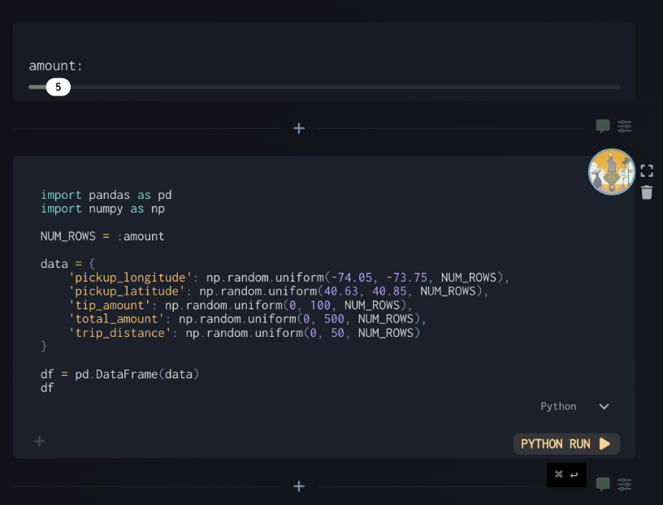
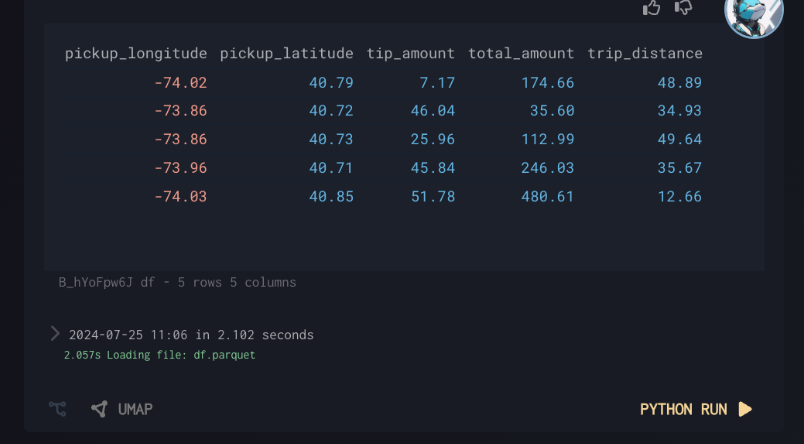

# Running Python Code

The Python Run interface allows you to execute Python code directly within Graphistry. This feature supports interactive data manipulation with input controls, visualization of results, and seamless data sharing.

## Python Interface Components

### Text Input to Python
You can write Python code in the editor area. Common imports like pandas and numpy are often used for data manipulation.

### Input Controls
- **Input Sliders**: Create interactive parameters like `:amount` that can be adjusted with sliders
- These variables are accessible directly in your Python code (e.g., `NUM_ROWS = :amount`)

### Running Your Code
Click the "Run" button to execute your Python code and see the results.

### Output Handling
- **Single Variable Output**: The last variable in your code will be automatically displayed
- **Named Artifacts**: Use `save_artifact(data, "name")` to explicitly save and name your outputs
- **Multiple Outputs**: Compatible with saving multiple artifacts in a single run

### Accessing Saved Data
Dataframes and other artifacts can be referenced in subsequent Python code:

