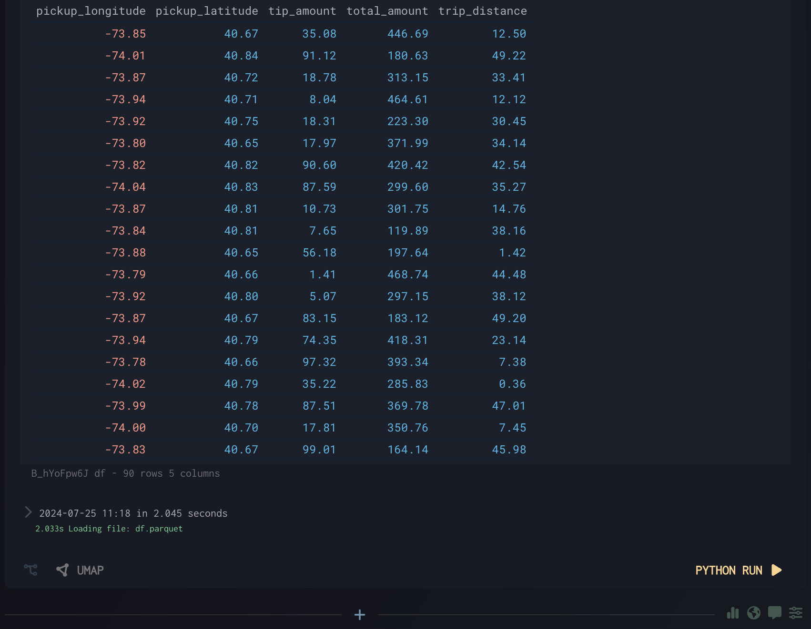
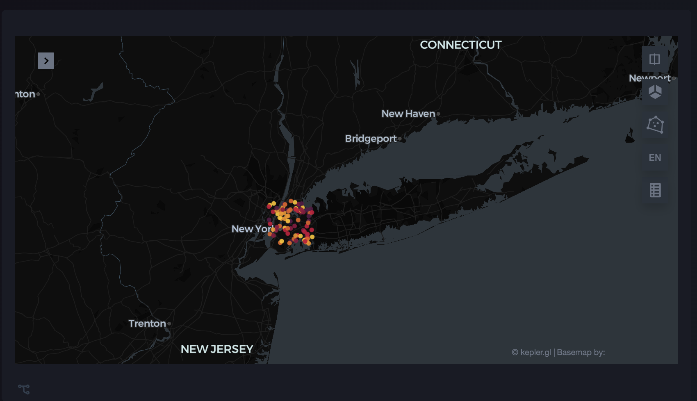
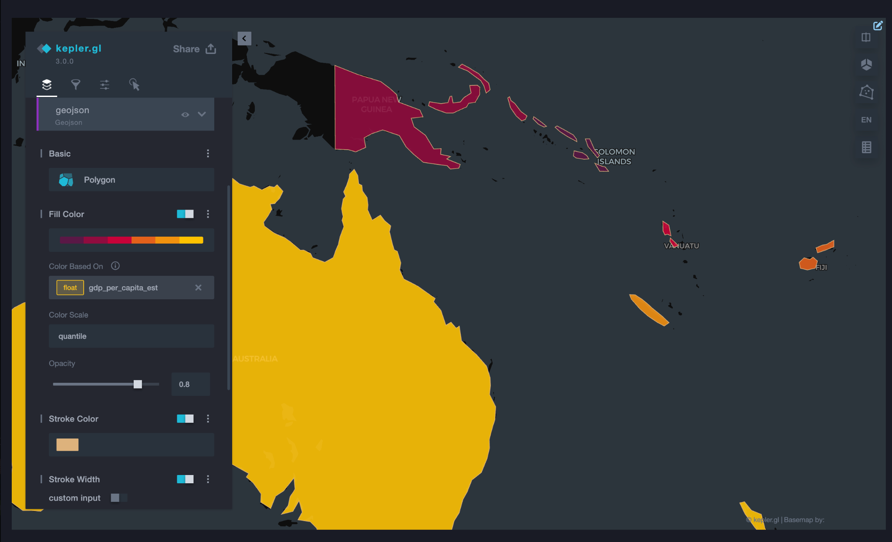
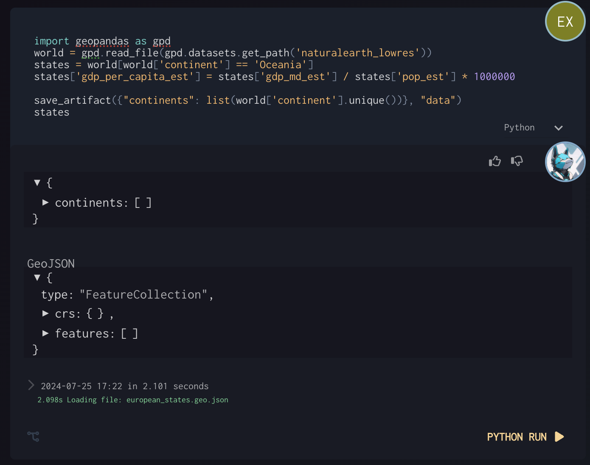

# Python Maps

Python Maps

Click to add Geo Visualization when GeoJSON or dataframe with geo columns is above

Df has Latitude & Longitude columns

Geo Pandas Example: 
(continents json output for debug inspection)

^ Setting polygon color
Edit appearance in Kepler

Example with two outputs

