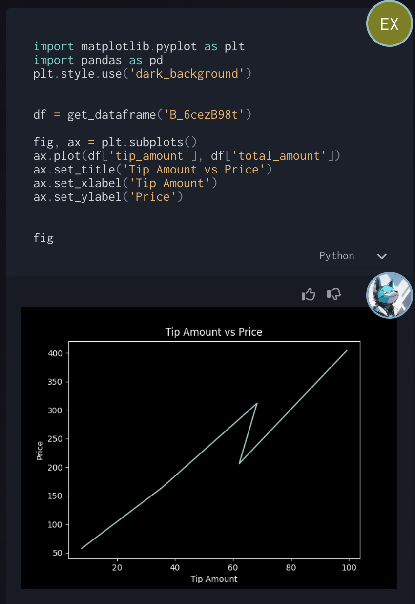
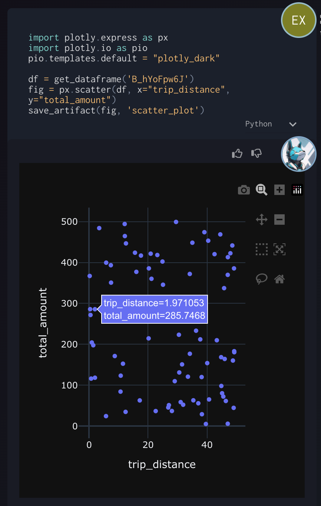

# Python Outputs

Python Outputs

Supported Outputs
save_artifact(x, "name")

- Pandas DataFrame
- Pandas Series
- Dict                                         as Json
- String                                      as Markdown
- Matplotlib Figure                    as png
- PIL Image                                as png
- Plotly Figure Plotly                  Plotly Json
- GeoDataFrame                       as GeoJson
- GeoJSON FeatureCollection  as GeoJson

Matplotlib (seaborn)

Plotly w/ Interactivity
Our default charts use Plotly also

EXAMPLES

