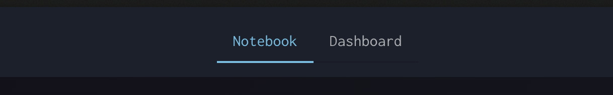

# Notebook vs Dashboard Tabs

Notebook vs Dashboard Tabs

At the top of each Notebook you'll find a set of tabs that allow you to switch between "Notebook" and "Dashboard".

"Dashboard" will open the respective Dashboard view of that thread and allow you to create panels with dependencies from the thread.

