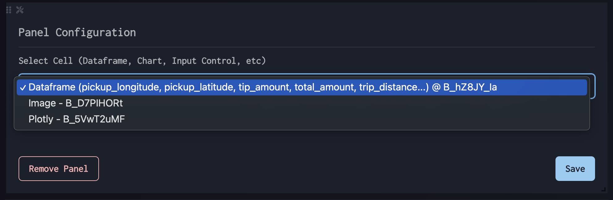
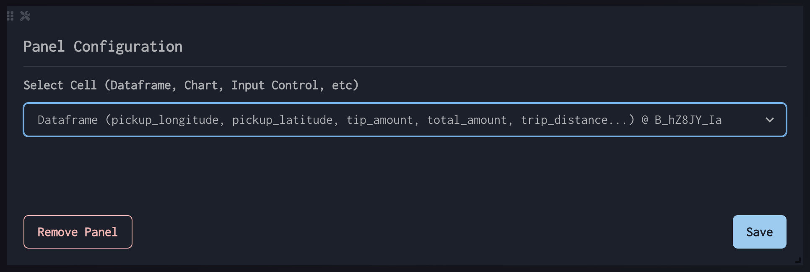

# Add & Edit Panels

Add & Edit Panels

Start by clicking on the "Add New Panel" button which will always be at the bottom of the page.

Select the Cell Element that you want to appear in the panel, then click "Save"

Editing an individual panel can be done by clicking the Wrench + Screwdriver icon in the top left.

