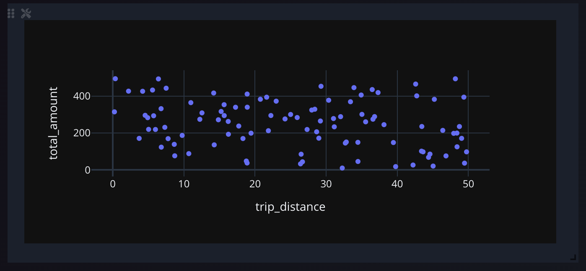
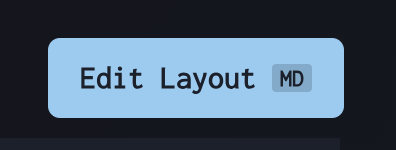

# Responsive Panel Layouts

Responsive Panel Layouts allow you to create adaptive dashboard designs that work across different screen sizes and devices.

## How to Edit Layouts

Start editing panels by clicking "Edit Layout" in the top right.

To support responsive layouts each breakpoint can be assigned a specific layout based on your changes. They will cascade down from the largest, so changes to smaller breakpoints will override the larger layouts.

The label inside of the button will inform you of which breakpoint you are currently editing.

Drag each panel using the drag handler in the top left, and resize them by using the resize handler in the top right.

## Interface

