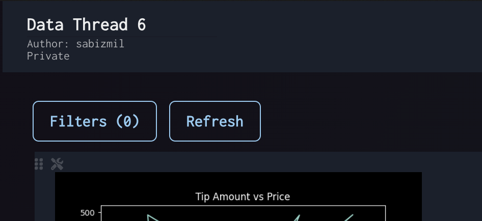

# Refresh Data

Refresh Data

Clicking "Refresh" at the top of the page will effectively re-run all cells within the thread to:

Recalculate and retrieve fresh dataframes
Regenerate and display new charts and visualizations
Apply any changes made to cells within the thread

All updates and changes that result from this refresh will be applied to the panel contents automatically, without the need to manage any panel configurations.

This will not affect the layout of the page and only applies to the underlying dataframes and visualizations that the panels are reading from.

