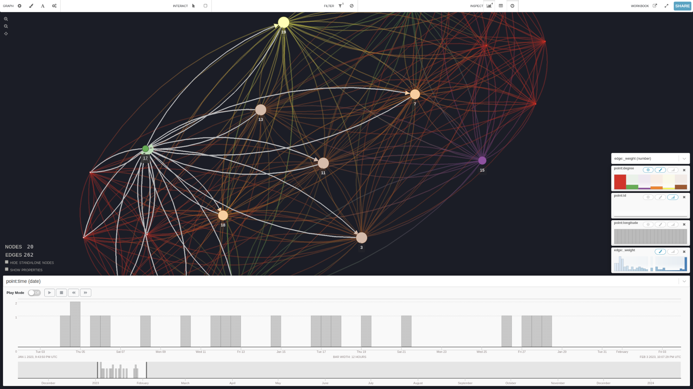
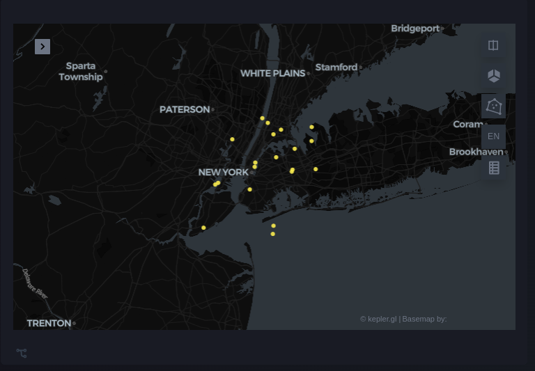
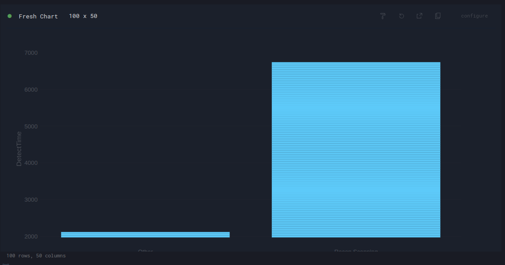
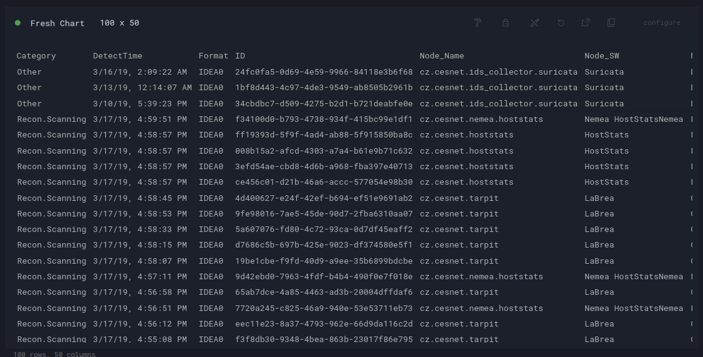
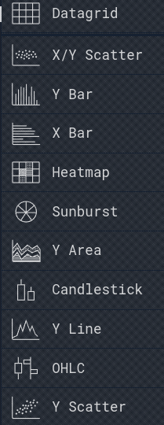

# Many Visualization Types Natively Supported

Many visualization types natively supported



Graphs
Graphistry

Maps
kepler.gl

Charts
Perspective
w/ Plotly

+ More: Code agent can generate anything 

Charts

