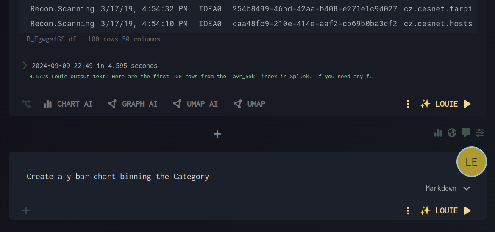
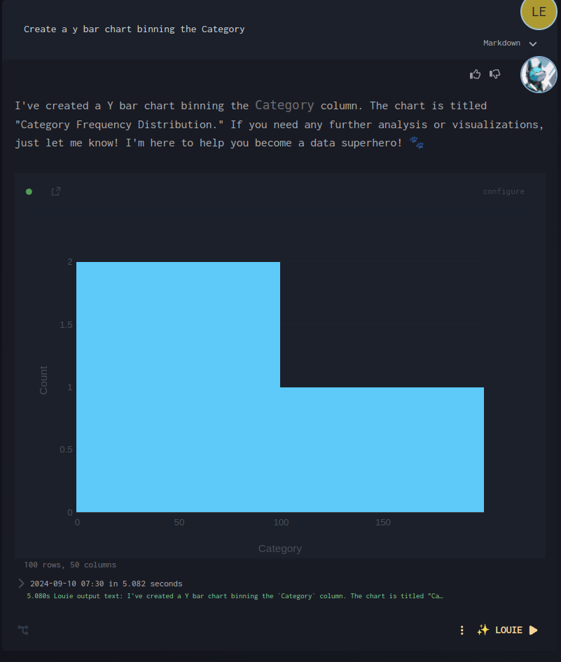

# Chart AI

Chart AI allows you to ask for charts in natural language.

Charts act on dataframes: Specify the dataframe ID, or let Louie guess the nearest dataframe.

## Best Practices

A good chart prompt describes:
- Chart type
- Which dataframe, by ID
- Which dataframe column names
- Chart-specific options

## Quick Start
Use prefilled AI prompt cells:
1. Dataframe ID
2. Chart prompt

