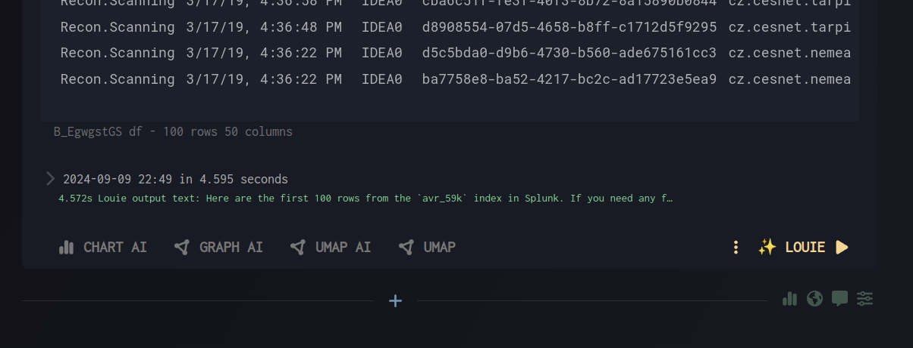
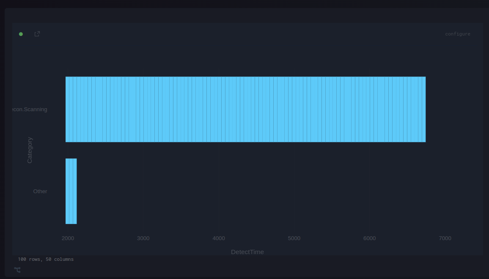

# Chart Passthrough

Chart passthrough provides point-and-click chart creation.

Every cell with a dataframe provides visualization buttons.

## Chart Types
Pick an icon corresponding to:
- Charts: Standard - X, Y, Scatter, …
- Graph: Network diagram
- UMAP
- Map (GIS)

## Variants
Each has 2 variants:
- AI - configure via natural language
- Passthrough - point-and-click

Available options:
- AI chart, graph, UMAP
- Passthrough chart, map

