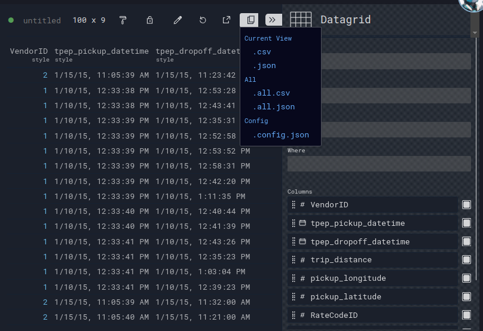
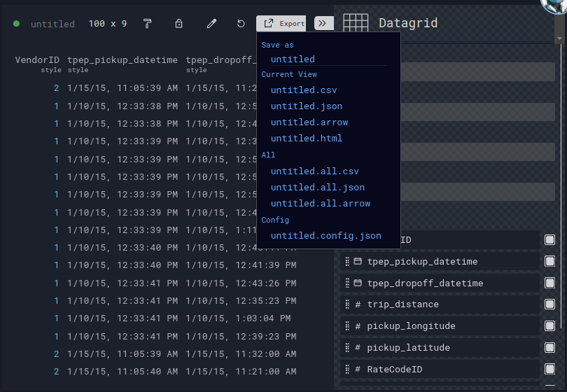
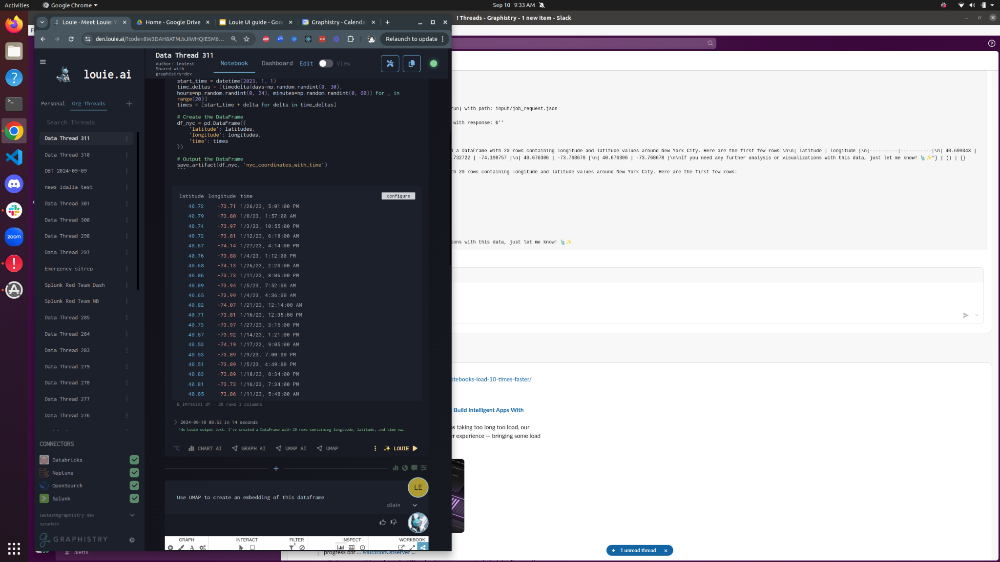

# Perspective: Data Download

Configure

Export (download)

Either download file, or copy into clipboard 

Multiple export formats: CSV, JSON, Arrow, HTML

Note: When system sets all datagrids as 'editable', can also copy individual rows/cells

Clipboard copy

