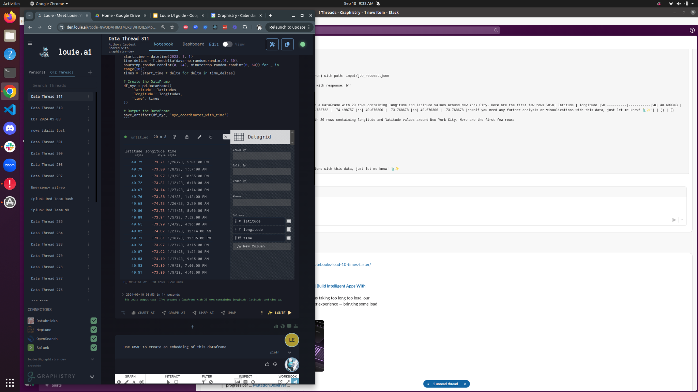
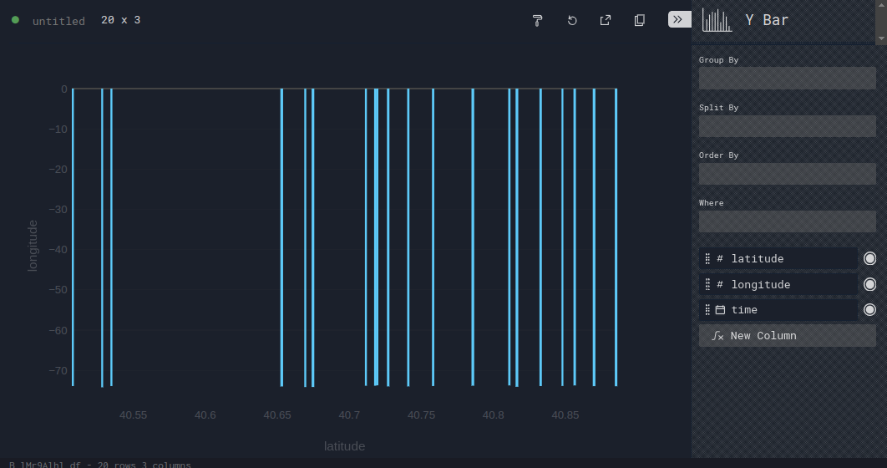

# Perspective: Chart Switching

## Features
- Configure
- Chart type picker panel
- Point-and-click chart switcher
- Supports standard charts (Perspective), but not maps & graphs

Tip: Datagrid is also a standard chart type!

## Components
- Chart type item selector

<!-- 

 -->

