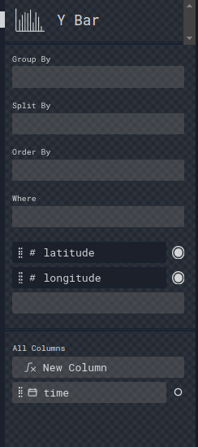

# Perspective: Expressions - Column Selection

Selected

Perspective: Expressions - Column selection

Column selection

Each chart acts on one or more columns

First column:

Typically for X axis

Second column

Provided: Y axis
Not provided: Count

Tip: Also include columns in Order By

Reorder

Remove

Add

Unselected

