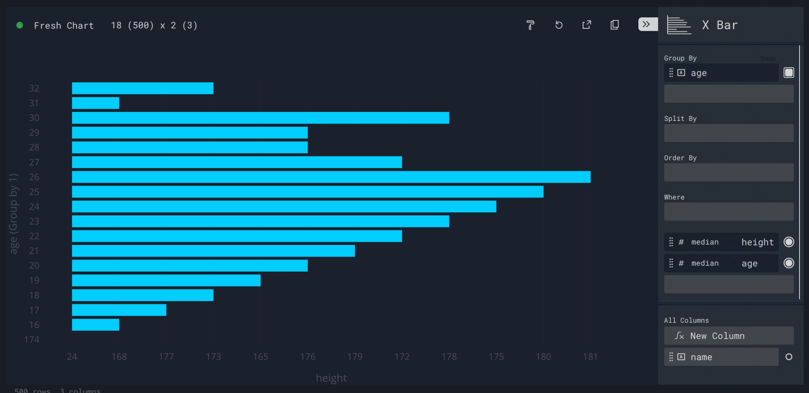

# Perspective: Expressions - Group By

Group By

A group by groups the dataset by the unique values of each column used as a group by - a close analogue in SQL to the GROUP BY statement. 

The underlying dataset is aggregated to show the values belonging to each group, and a total row is calculated for each group, showing the currently selected aggregated value (e.g. sum) of the column. 

Group by are useful for hierarchies, categorizing data and attributing values, i.e. showing the number of units sold based on State and City.

