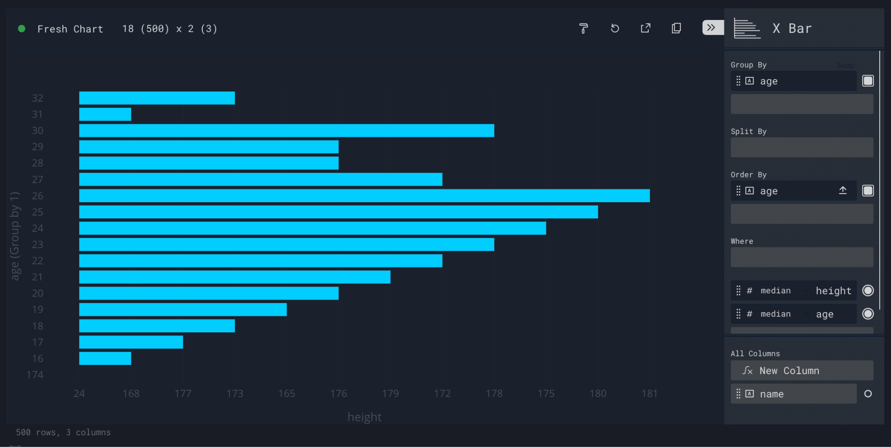

# Perspective: Expressions - Order By

Order By

The order property specifies columns on which the query should be sorted, analogous to ORDER BY in SQL. 

A column can be sorted regardless of its data type, and sorts can be applied in ascending or descending order. 

