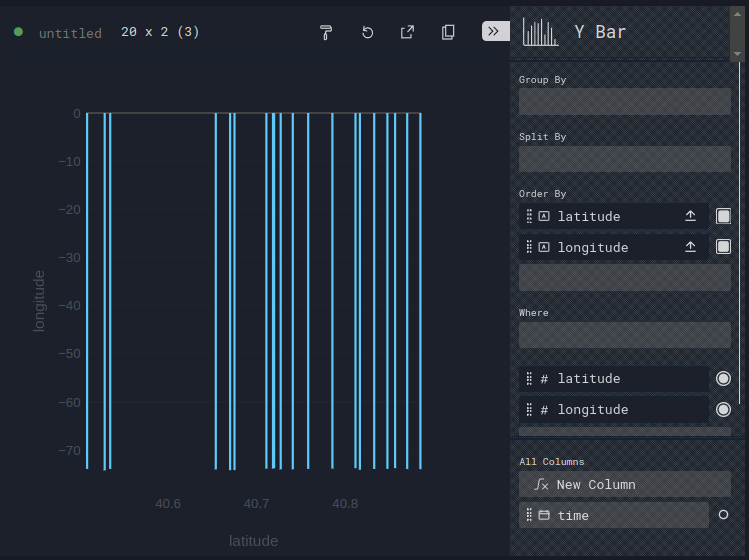
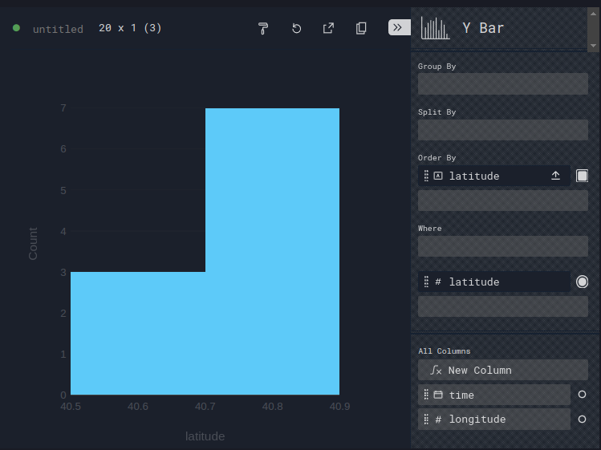

# Perspective: Chart - Y Bar

Single dimension:
Count by primary dimension

Two dimensions:
Group within a bin by secondary dimension
Compute aggregate statistic on each group

Tip: Sort each dimension

