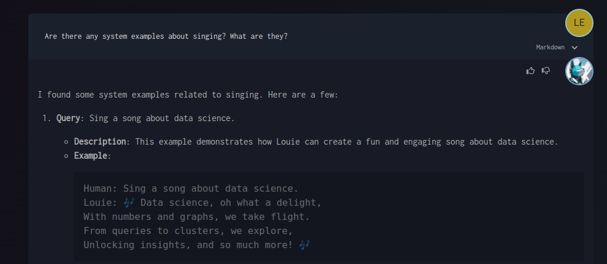

# Louie Uses and Learns AI Knowledge Bases

Louie matches your text to Examples and Recipes, allowing you to teach Louie from data threads using both types of knowledge.

## Examples

Examples are great for simple scenarios and facts:
- Matching is performed against Query + Description
- Answering considers Query, Description, and Example content

## Recipes

Recipes are great for multi-step workflows:
- Distills datathread multi-cell streaks into reusable recipes
- Learns from both successes and failures

## Learning Louie

The following images demonstrate how Louie's knowledge base works:

