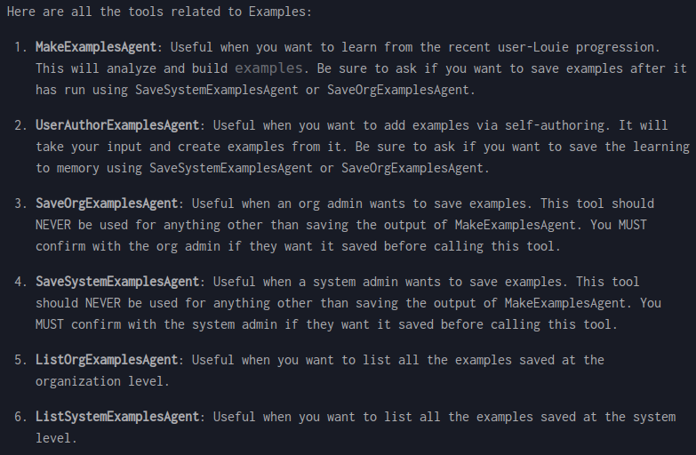

# System-level: For All Users, Only Admin-editable

System-level: For all users, only admin-editable
Organization-level: For all org users, only org-admin-editable

Tell Louie to run ListOrgExamplesAgent or ListSystemExamplesAgent

Tell Louie to create a draft via MakeExamplesAgent or UserAuthorExamplesAgent …

… then save: SaveOrgExamplesAgent or SaveSystemExamplesAgent

Examples

For simple scenarios and facts

