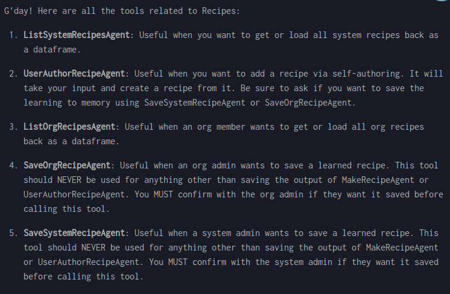

# Recipes

Recipes

For multi-step workflows

System-level: For all users, only admin-editable
Organization-level: For all org users, only org-admin-editable

Tell Louie to run ListOrgRecipesAgent or ListSystemRecipesAgent

Tell Louie to create a draft via UserAuthorRecipeAgent …

… then save: SaveOrgRecipeAgent or SaveSystemRecipeAgent

