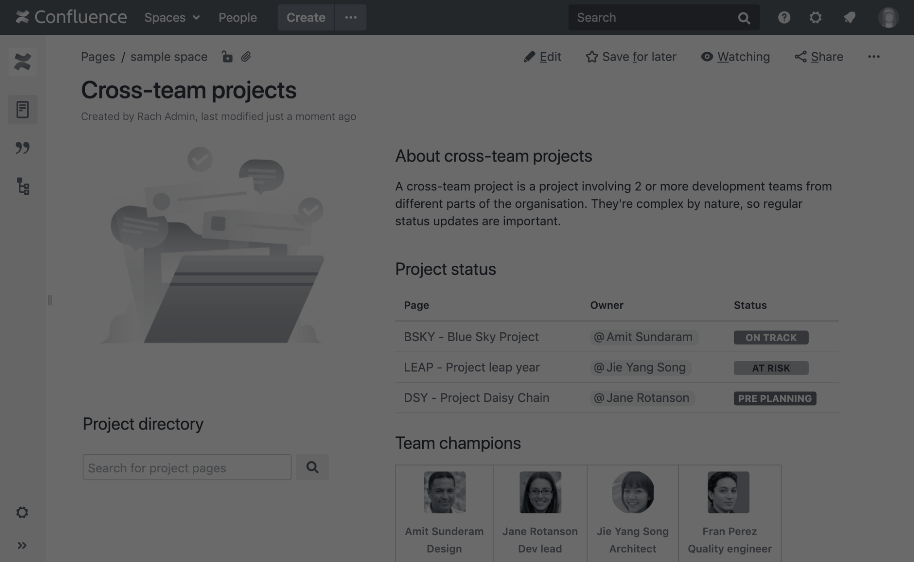

# Democratizing Data Access

‹#›

SQL

Cypher

DB queries & Python data science are superpowers... 

Splunk

What if anyone could talk to their data?

Documents, comms, …

Security, fraud, supply chain, customer analytics, …

