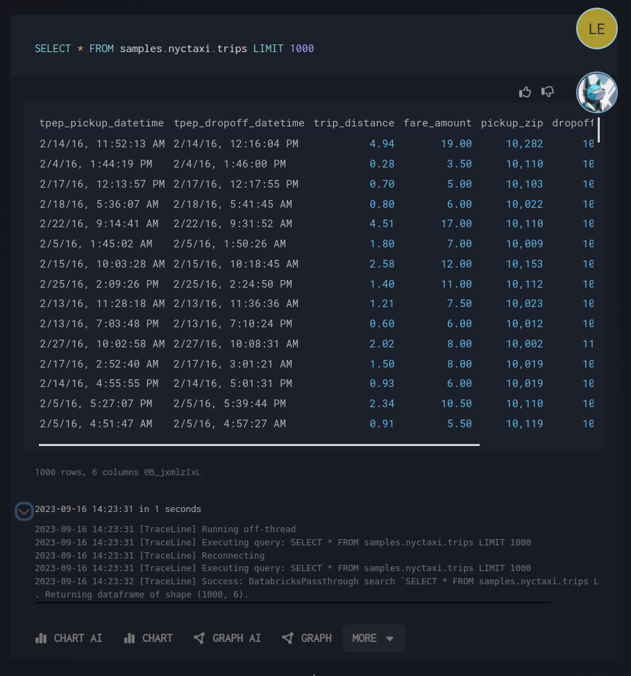
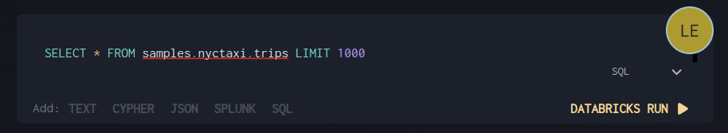
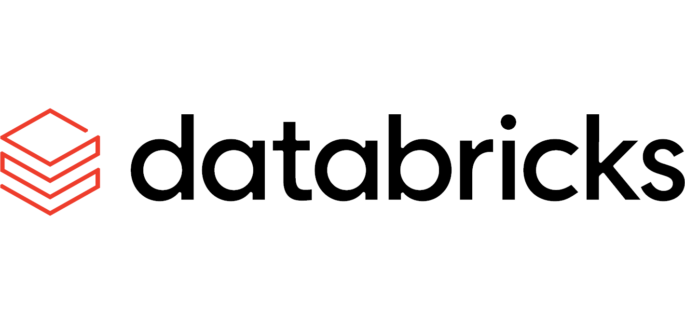

# Running Databricks SQL Blocks

Databricks SQL blocks allow you to write and execute SQL queries directly in your workspace with enhanced tooling and visualization capabilities.

## Key Features

- **Quick actions**: Streamlined workflow for common SQL operations
- **Command interface**: Direct SQL query execution
- **Table shape analysis**: Automatic data structure insights
- **Decision tracking**: Activity logging and query history
- **Query results**: Immediate execution with rich visualizations

## Interface Overview

