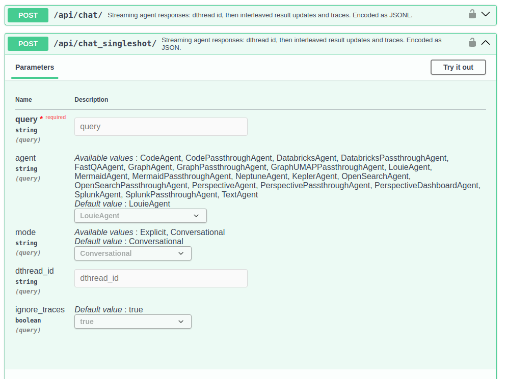

# Louie API for Conversational Analytics: Embedding, Headless, etc.

Louie API for conversational analytics: Embedding, headless, …

https://<site>/api/docs

Streaming (/api/chat) and blocking modes

Start a new chat or continue an existing one

JWT auth: "Authorization: Bearer XYZ"

Additional APIs for accessing referenced rich media
Ex: Load data tables as JSON or Arrow

Many documented options

Contact staff for the latest

Test live

Set JWT token

